# BMS — Li-ion Battery SOC Estimation

Final project for **Sistem Kendali Prediktif & Adaptif**: online identification of battery model parameters and *State of Charge* (SOC) estimation using FFRLS, Levenberg–Marquardt, and an Extended Kalman Filter in MATLAB.

## Overview

The battery is modelled as a **2nd-order Thevenin equivalent circuit (2-RC)**:

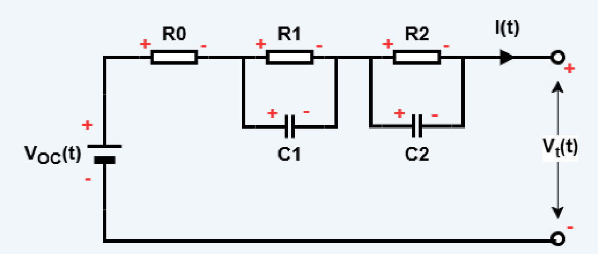

The pipeline works in four stages:

1. **OCV–SOC curve** is derived from OCV test data by polynomial fitting (orders 2–12, lowest RMSE wins, fitted separately for charge and discharge).
2. **FFRLS** (Forgetting Factor Recursive Least Squares, λ = 0.98) identifies the discrete transfer-function parameters θ₁…θ₆ online from current/voltage data, which are then inverted into R0, R1, R2, C1, C2, Uoc.
3. **Levenberg–Marquardt** refines the FFRLS estimate at each time step through nonlinear optimisation against θ.
4. **EKF** uses the LM parameters to estimate the state `[U1; U2; SOC]`, benchmarked against *Coulomb counting*.

## Dataset

Battery test data for an **A123 18650 LiFePO4 cell, 1100 mAh, 25 °C** (CALCE format):

| File | Contents | Columns used |
|---|---|---|
| `A1-007-OCV-25-20120905.xlsx` | OCV test, cell #007 | 1 = time, 2 = current, 3 = voltage |
| `A1-008-OCV-25-20120905.xlsx` | OCV test, cell #008 | same |
| `A1-007-DST-US06-FUDS-25-20120827.xlsx` | Dynamic DST/US06/FUDS profile, cell #007 | 1 = time, 4 = current, 5 = voltage |
| `A1-008-DST-US06-FUDS-25-20120827.xlsx` | Dynamic profile, cell #008 | same |

Nominal capacity used throughout: `Cn = 1.1 Ah`.

> The scripts are hardcoded to cell **A1-007**. To run cell 008, change the filename in the *Read Data* section of each notebook.

## Repository Layout

**Live scripts, in execution order:**

| File | Role | Reads | Writes |
|---|---|---|---|
| [SoCApprox.mlx](SoCApprox.mlx) | OCV–SOC polynomial fitting | `A1-007-OCV-*.xlsx` | `_polynomialEstimate.txt` |
| [FFRLS.mlx](FFRLS.mlx) | Online parameter identification | `A1-007-DST-*.xlsx` | `_FFRLSParameters.txt`, `_discreteParameters.txt` |
| [LM.mlx](LM.mlx) | Levenberg–Marquardt refinement | `_discreteParameters.txt` | `_LMParameters.txt` |
| [EKF.mlx](EKF.mlx) | SOC estimation | `_LMParameters.txt`, `_polynomialEstimate.txt` | SOC / Ut / Uoc plots + error |

**Helper functions:**

- [UocCurve.m](UocCurve.m) — evaluates OCV from SOC, selecting the charge or discharge coefficient set based on current sign, and clamping below the minimum fitted SOC.
- [dUocCurve.m](dUocCurve.m) — dOCV/dSOC derivative, used as the SOC entry of the EKF output Jacobian.

The `.txt` files above are intermediate artefacts and are not tracked in the repository, so **run the stages in order** on a fresh clone — each stage consumes what the previous one produced.

## Running It

Requires **MATLAB** (tested on R2024b). No extra toolboxes — only `polyfit`, `readmatrix`, and `readtable`.

```matlab
% from the project folder
run SoCApprox.mlx   % 1. OCV-SOC curve
run FFRLS.mlx       % 2. parameter identification
run LM.mlx          % 3. refinement
run EKF.mlx         % 4. SOC estimation
```

## Results

### OCV–SOC Model

Order-12 polynomials gave the lowest RMSE for both directions: **0.04234 V** for charge and **0.01888 V** for discharge. Below the minimum SOC present in the fitting data, OCV is held flat at the minimum measured value — the horizontal segment on the left of each curve.

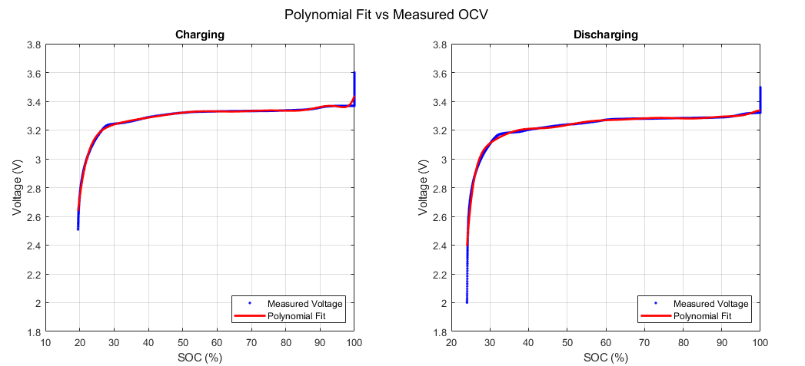

Approximation error across polynomial orders — fainter lines are lower orders, the most visible line is order 12:

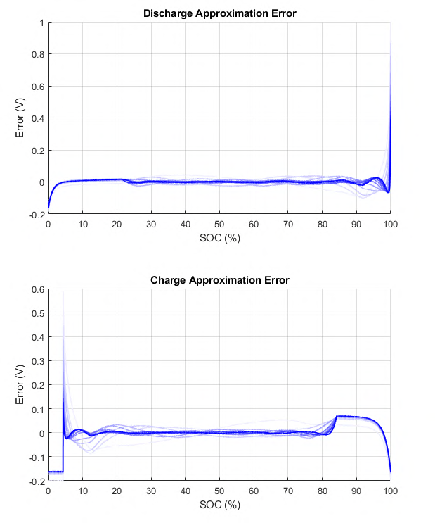

### FFRLS

Discrete parameter estimates θ₁…θ₆ with λ = 0.98:

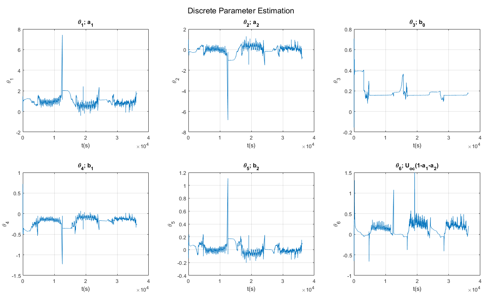

Inverted into RC-model parameters:

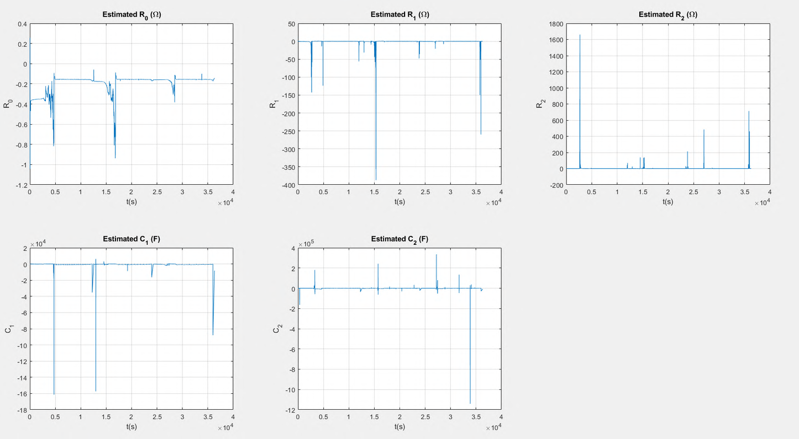

To keep the estimate from diverging when the covariance matrix `P` becomes ill-conditioned, an *improved FFRLS* step checks each parameter against a ±3σ band over the last 100 samples. On a violation it backtracks up to 40 previous θ estimates and keeps the one with the smallest prediction error, exiting early once the error drops below 0.05 V.

### Levenberg–Marquardt

LM is initialised from the FFRLS estimate and refined per time step (μ₀ = 1e3, c₁ = 0.1, c₂ = 10, maxIter = 20, tol = 1e-2), with the Jacobian computed by finite differences (δ = 1e-6).

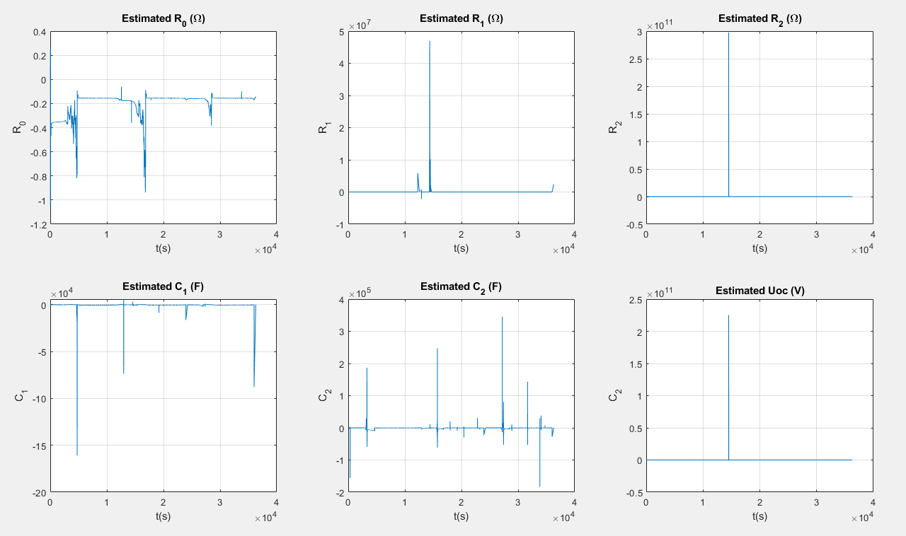

Compared side by side against FFRLS:

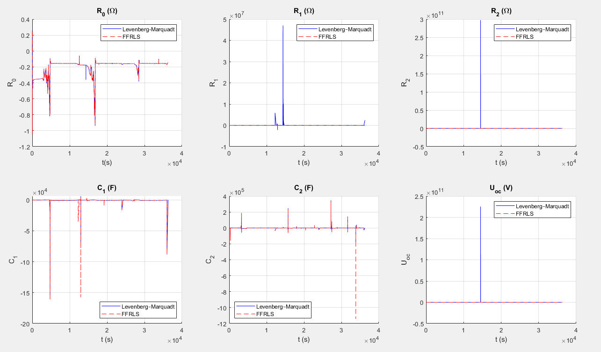

### Extended Kalman Filter

Three states are estimated: `[U1, U2, SOC]`, with `Q = diag([1e-6, 1e-6, 1e-6])`, `R = 1`, and `P₀ = I`.

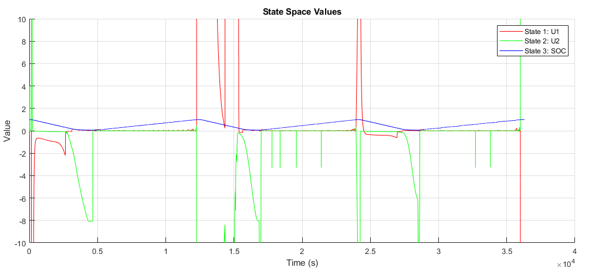

SOC estimate against the Coulomb-counting reference, with percentage error:

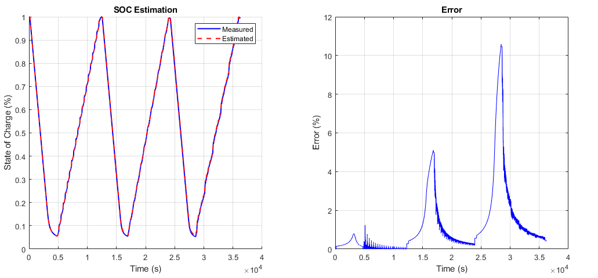

Reconstructed open-circuit voltage:

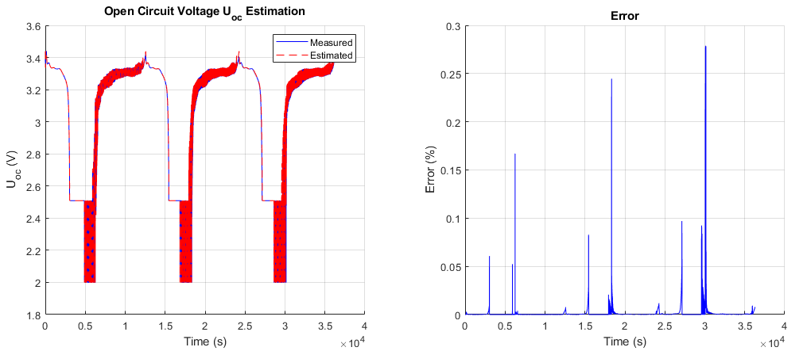

Reconstructed terminal voltage:

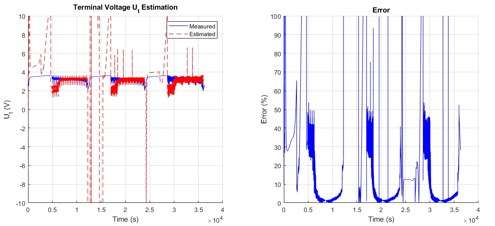
